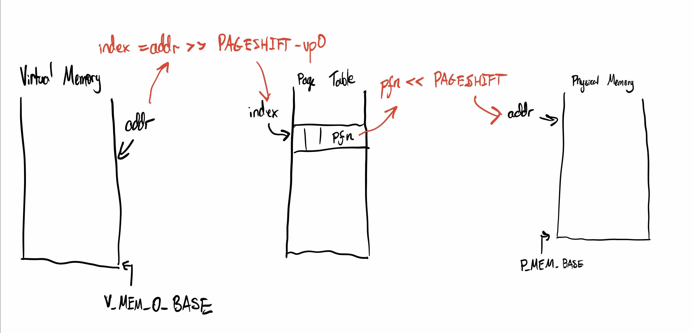

# Checkpoint 2 Writeup

**Did we make the checkpoint:** No. :( But nearly!

We think we got most of `KernelStart` and , we're printing a bunch of stuff out and it looks correct, however one of the helper functions that are called after kernel start is reading trash, and we couldn't find that trash in page table1.

**Does it compile and run:** It compiles, runs through Kernel start entirely, then segfaults in `helper.c` in the `check_ptbr1()` function.

## 


## SEGFAULT: greenscreen of death! - details on the error and our debugging efforts

- After going through `StartKernel`, the program segfaults

- We think this happens while the hardware is setting up `DoIdle`


Calling `bt` in gdb gives us:

```gdb) bt
(gdb) bt
#0  0xf7ee805e in check_ptbr1 () at helper.c:344
#1  0xf7ee81fb in check_memory () at helper.c:396
#2  0xf7ee44a1 in RealSignalHandler (sig=11, si=0xffb0c, context=0xffb8c)
    at exception.c:1339
#3  0xf7ee4700 in SignalHandler (sig=11, si=0xffb0c, context=0xffb8c)
    at exception.c:1541
#4  <signal handler called>
#5  DoIdle () at boot.c:242
#6  0x00000000 in ?? ()
```

So it seems our `pc` is pointing to `DoIdle` correctly, but something is going wrong in `check_ptbr1`, so we think it's to do with our region 1 page table.

When calling

```(gdb) info local
(gdb) info local
i = 1
pfn = 3486256
ptep = 0x26aac
ptp = 0xf7efbb40 <proc_table>
```

We see that the `pfn` being accessed is some junk. So we traceprinted everything in our region 1 page table (it'll traceprint below the message "printing stuff inside user page table") and there are no matches. (We were thinking if we found trash in some entry in region 1's page table, we'd be able to find out how we set it up wrong). None of the trash in both our page tables lined up with the `pfn` given in `info local` (`3486256`). This left us really confused because we don't know where its getting this trash. 

We thought this problem could have been because we gave the wrong address of our page tables to the registers `PTBR0` and `PTBR1`, but when we changed how we referred to our page tables (e.g. passing `&u_bp` to the registers instead of `u_pt` ) we got errors that occurred before exiting `KernelStart` (when enabling VM) so we *think* we're already doing it right.


note: we have a BUNCH of traceprints that we didn't comment out for debugging reasons. We really want to get the bug figured out as soon as possible for checkpoint 3, so if anything we're doing is unclear, please contact us! (We don't want to waste your time either.)


## How we compiled and ran

- everything in our git (NalaOS folder if you git cloned/downloaded it) was put in a folder cause `src`, including the makefile. This `src` folder was outside of `yalnix_framework` and was run on our VM.
- So calling tree in our VM gives:

```├── src
├── src
│   ├── boot.c
│   ├── Makefile
│   ├── pipe.c
│   ├── pipe.h
│   ├── process.c
│   ├── process.h
│   ├── queue.c
│   ├── traphandlers.c
│   └── traphandlers.h
└── yalnix_framework
    ├── etc
	...
```

- Then we went into the `src` directory and called `make`.

## What we did

- created a file `boot.c` which contains `KernelStart` and `SetKernelBrk`. I think `SetKernelBrk` will end up in a separate source file, but it hasn't been created yet.
- For `KernelStart` (8.2.1 and 8.2.2)

  - set up `bit_vector` to keep track of free frames
  - For the **two regions' page tables being set up**, I think this diagram does a good job showing what our understanding of yalnix's page table and how the hardware communicates with it.
    - 
    - given an address, we bitshift the address to the right by PAGESHIFT to turn the given address into page numbers, as described in 2.2.1
    - Then, we subtract this calculated virtual page number (or `vpn`) by the virtual page number of the 0th page, `vp0`. This gives us the index into the page table.
    - So for setting up Region 0's page table, we decided to turn each of the given addresses (e.g. `_kernel_data_start`, `_kernel_data_end`,`KERNEL_STACK_BASE`, etc) into virtual page numbers, then iterate through the indices of the page table, assigning pages if they fit in the ranges of each segment's `vpn` - `vp0`.
    - By doing this, we reserve the segments for `.data`, `.text`, the `heap` and the `stack`.

  - set up Region 1 page table
    - Went to `VMEM_1_LIMIT` - 4, that's where our `sp` is, we allocated that page in region 1's page table. So that's the final entry of the page table for region 1
  - enabled virtual memory.
- Wrote `SetKernelBrk` in `boot.c`. (8.2.2)

  - use a global `kernel_brk` to keep track of where the brk is, also makes sure we don't mess things up when we enable virtual memory
- Oddly enough, `SetKernelBrk` isn't called in `KernelStart`, even when we malloc. I tried to call `malloc(90000)`, and then `SetKernelBrk` is called and behaves correctly.
- For the many Traps (8.2.3)

  - traceprint when there's a `TRAP_CLOCK`
  - traceprints the code of the syscall for `TRAP_KERNEL`s
  - and prints this trap is not yet handled in other handler functions.
- For settiing up `idlePCB` (8.2.4)

  - this happens within `boot.c` near the end of `KernelStart`
    - followed instructions
    - regarding "cook[ing] things so that when you return to user mode at the end of `KernelStart`, you return to this modified UserContext", we set the `sp` to a valid page at the top of region1's address space. And we pointed `pc` to `DoIdle`.


